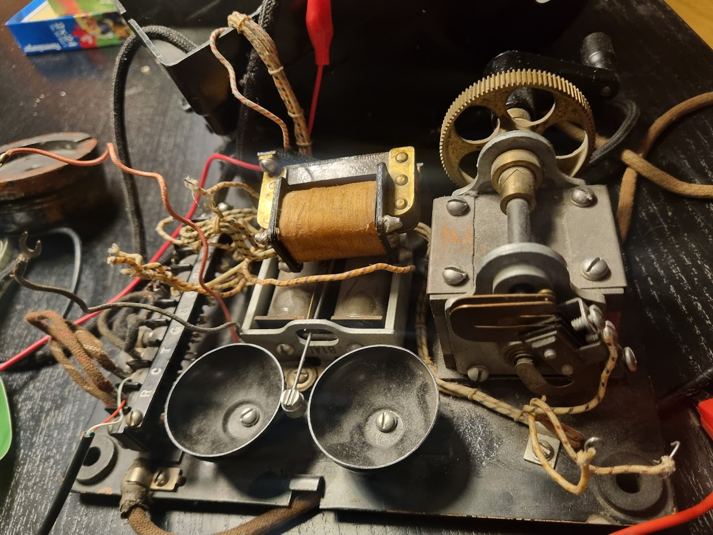

# Telephone-1940s


*Photo from the [full project story](https://munir.is/en/literature/grandfathers-telephone).*

This is a completed family-history project built around my grandfather's Western Electric telephone, first put into use around 1940 at Dvergasteinn in Reyðarfjörður. The phone's number was 52. Today, turning its original crank rings the mechanical bells; lifting the receiver plays a recording in which my aunt Valgerður tells the phone's story.

Read the full story: [Grandfather's telephone — Andri - Datadude](https://munir.is/en/literature/grandfathers-telephone).

This repository documents one working installation and shares its code and supporting files. It is a hardware-specific reference build, not a tested, turn-key kit.

## How it works

- Turning the magneto crank while the receiver is on its hook triggers the ringer.
- The Raspberry Pi reads the hook and crank switches and controls a Silvertel AG1171 ringing module, which drives the phone's original bell.
- Lifting the receiver stops ringing and plays the recording after a 500 ms pause. Replacing the receiver stops playback.
- The Python program uses GPIO event detection with a 200 ms debounce to handle the phone's old mechanical contacts.

## Hardware and safety

The original installation uses:

- A Western Electric telephone with a mechanical bell, receiver, and magneto crank.
- A 2011 Raspberry Pi Model B, Revision 1.
- A Silvertel AG1171 ringing module.
- A separate audio recording (`valgerdur.wav` in the original setup); the recording is not included in this repository.

**Electrical caution:** the AG1171 produces approximately 90 V AC for the bell. Treat its ringing output as hazardous, disconnect power before wiring, and follow the [AG1171 datasheet](Ag1171-datasheet-Low-cost-ringing-SLIC-with-single-supply.pdf). Do not power the ringer from the Pi's 5 V rail: the current draw caused voltage drops and SD-card corruption during this build.

This project involves old, hardware-specific wiring and a high-voltage ringing circuit. Verify your exact Raspberry Pi board revision and telephone wiring before connecting anything.

## GPIO assignments

The script uses **BCM GPIO numbering**:

| Signal | BCM GPIO | Direction | Pull / active state |
| --- | ---: | --- | --- |
| Receiver hook switch | 17 | Input | Internal pull-down; HIGH when lifted |
| Magneto crank switch | 26 | Input | Internal pull-up; LOW when cranked |
| AG1171 ring mode (RM) | 27 | Output | HIGH while ringing |
| AG1171 forward/reverse (FR) | 22 | Output | Alternates to produce the ringing signal |

These are the assignments in [`2026-03-08-ringer-hook.py`](2026-03-08-ringer-hook.py), not physical header pin numbers. Check the pinout for your exact Pi revision before wiring; the original Model B Revision 1 differs from later boards.

## Run the program

1. Prepare a Raspberry Pi with a compatible Raspberry Pi OS, Python 3, `RPi.GPIO`, and `pygame`. The original project used an early Raspberry Pi Model B; package availability and GPIO support vary by OS version.
2. Connect the hook switch, magneto switch, and AG1171 control inputs according to the table above and the module datasheet. Keep the ringer's power supply separate from the Pi.
3. Provide the audio recording yourself. The script defaults to `/home/andri/tele/valgerdur.wav`; either place your recording at that path or edit `SOUND_FILE` near the top of the script.
4. From the repository directory, run:

   ```bash
   python3 2026-03-08-ringer-hook.py
   ```

5. With the receiver on its hook, turn the magneto crank and confirm that the bell rings. Lift the receiver to stop ringing and hear the recording; replace it to stop playback. Stop the program with `Ctrl+C`.

The repository does not include a systemd service or a known-good OS image. The script must be run in an environment with working GPIO access and audio output. For later Raspberry Pi deployment notes—including audio setup—see [`new_raspberry_model.md`](new_raspberry_model.md); those notes are not a validated setup recipe for the original Revision 1 board.

## Repository files

- [`2026-03-08-ringer-hook.py`](2026-03-08-ringer-hook.py) — GPIO monitoring, ringer control, and audio playback.
- [`new_raspberry_model.md`](new_raspberry_model.md) — notes from a later Raspberry Pi deployment.
- [`Ag1171-datasheet-Low-cost-ringing-SLIC-with-single-supply.pdf`](Ag1171-datasheet-Low-cost-ringing-SLIC-with-single-supply.pdf) — AG1171 datasheet.
- [`batterybox.3mf`](batterybox.3mf) and [`battery_label.jpg`](battery_label.jpg) — supporting enclosure and label assets.

## Development history

The first prototype used an Arduino and an MP3 module. I scrapped that code and moved the project to a Raspberry Pi so I could use Python for the GPIO and audio playback. The original build used a 2011 Raspberry Pi Model B, Revision 1; I later adapted the program for a Raspberry Pi 4.

The current script uses BCM GPIO assignments 17 (hook switch), 26 (magneto switch), 27 (AG1171 RM), and 22 (AG1171 FR). These are BCM GPIO numbers, not physical header-pin numbers. I still need to verify and document the Pi 4's physical wiring; see [issue #2](https://github.com/andriOlafsson/Telephone-1940s/issues/2).
